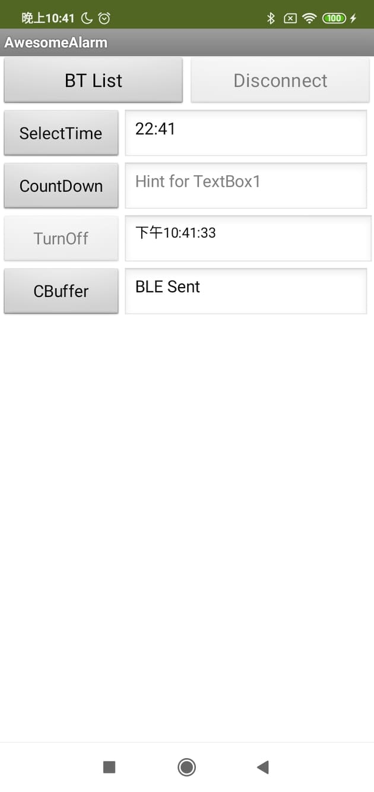

# 2019-AwesomeAlarm #
* Detect the postion of the human head!
* Use light to wake up the user!
* Turn off the alarm with laser! 
* Can be connected with Smartphone through BLE
* By adopting SDA/SCL, the connection type can easily be changed to other methods (WiFi, ...)

# App interface

# Logs:

- log 12.15 :

  Inited github `readme`.
  add basic code for servo motor manipulation

- log 12.21 :
  Create MainSystem.c
  Create Display_Light.c
  add LightSensor.c
  
- log 12.27 :
  Create face_tracking_client.c
  Create face_tracking_server.py

- log 12.28 :
  Create Buzzer.c
  Create Pan_Tilt_with_camera.c

- log 12.29 :
  add simple test code for pan tilt
  
- log 01.03 :
  add buzzer and ultra wave distance and BLE
  add SDA/SCL function
  add BLE
  add buzzer, ultrawave sensor
  add human-head detection function
